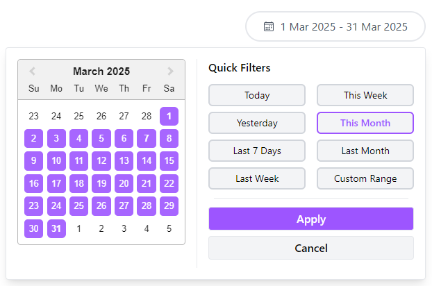

# @trackpilots/date-picker


A **customizable date picker** component built with **React** and **Tailwind CSS**.

## ✨ Screenshots  


---

## 🚀 Installation  
You can install the package using **npm** or **yarn**:  

### **Using npm**  
```sh
npm install @trackpilots/date-picker
# or
yarn add @trackpilots/date-picker
```

Make sure Tailwind CSS is installed in your project.

##  📌 Usage
Use in Your Component
```sh
import React, { useState } from "react";
import DateFilter from "@trackpilots/date-picker";

const App = () => {
  const [selectedDate, setSelectedDate] = useState(null);
  const [chosenDate, setChosenDate] = useState(null);

  const handleSelect = (date) => {
    setSelectedDate(date);
    console.log("Selected Date:", date);
  };

  const handleChoose = (date) => {
    setChosenDate(date);
    console.log("Choosed Date:", date);
  };

  return (
    <div className="p-4">
      <h2 className="text-lg font-bold">Date Picker</h2>
      <DateFilter
        defaultChoosenDate={"This Month"}
        onSelect={handleSelect}
        onChoose={handleChoose}
        selectedColor="#FF5733"
      />
      <p className="mt-2">Choosed Date: {chosenDate ? chosenDate.toDateString() : "None"}</p>
      <p>Selected Date: {selectedDate ? selectedDate.toDateString() : "None"}</p>
    </div>
  );
};

export default App;
```

## 📌 DateFilter Component
A React Date Filter component that allows users to select predefined date ranges like "Today", "Yesterday", "Last 7 Days", "Last Week","This Week", "This Month", "Last Month" or "Custom Range".

## ⚙️ Props  

| Prop Name      | Type              | Default          | Description                          |
|---------------|------------------|----------------|----------------------------------|
| `defaultChoosenDate`   | `string` or `null`  | `Today` | Predefined date range selection (e.g.,"Today", "Yesterday", "Last 7 Days", "Last Week","This Week", "This Month", "Last Month", "Custom Range").|
| `startDate`   | `Date` or `null`  | `null`         | The starting date of the picker. |
| `endDate`     | `Date` or `null`  | `null`         | The ending date of the picker.   |
| `onSelect`    | `function`        | `() => {}`     | Triggered when a date is selected. |
| `onChoose`    | `function`        | `() => {}`     | Triggered when a date is choosed. |
| `selectedColor` | `string`        | `"#9D55FF"`    | Highlight color for the selected date. |
| `icon`        | `React.ElementType` | `IoCalendarOutline` | Custom calendar icon component. |
---

## **✨ Example**  
```sh
<DateFilter 
  startDate={new Date("2024-06-01")} 
  endDate={new Date("2024-06-30")} 
  onSelect={(date) => console.log("User selected:", date)} 
  onChoose={(date) => console.log("User Choosed:", date)} 
  selectedColor="#007BFF"
/>
```

## 📦 Dependencies  

- [React](https://react.dev/)  
- [Tailwind CSS](https://tailwindcss.com/)  
- [react-icons](https://react-icons.github.io/react-icons/) (for `IoCalendarOutline` icon)  


## 📌 Maintainers
These packages are maintained by [**Quick App Studio**](https://quickappstudio.com/our-team) Developers.

##  📄 License
This project is licensed under the MIT License.